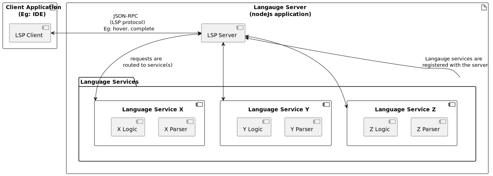
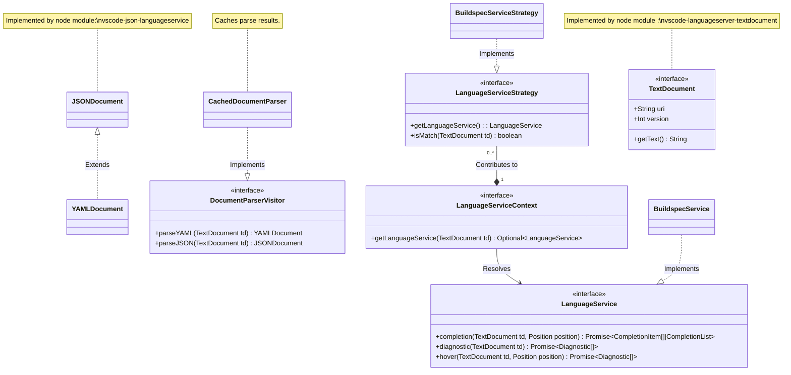

# TODO : IDE-10874 : This page is out of date while working in a feature branch

# Architecture

The application consists of two components: the language server, and the language services.

The **Language Server** is the containing application. It hosts language services, implements the Language server protocol (LSP), and queries information from language services in order to resepond to LSP requests.

The **Language Services** are document-specific implementations that understand how to parse and interpret certain file types. These are used by the language server in order to provide LSP clients with details that power language assistance functionality.

## Language Server



At start-up, the language server registers its language services, waits for an LSP client to connect, then responds to requests. When feature specific requests are made by the LSP client, the language server makes a query to relevant language services, and the results are returned to the LSP client.

Language service can vary in their supported capabilities, and in how much business logic they define. Language services can also share a common parser - for example, several document types may be based on YAML or JSON parsing.

## Language Service

The following is a class diagram for the underlying Language Service.
These are the components that enable users to provide a text document
and get language support (hover, completion, ...) through Typescript code (as a Node module).

This is separate from interfacing with it through a Language Server.

### Example pseudocode:

A quick example of how you would go from a text document
to getting completion results.

```typescript
// Text document we want to do completion for
incomingTextDocument: TextDocument = ...

// Create language service strategy instances.
// Note each strategy consumes the document parser, the strategy should know which parser to use.
languageServiceStrategyA: LanguageServiceStrategy = new LanguageServiceStrategyA()
languageServiceStrategyB: LanguageServiceStrategy = new LanguageServiceStrategyB()

// Add strategies to the context
languageServiceContext: LanguageServiceContext = ...
languageServiceContenxt.addStrategy(languageServiceStrategyA)
languageServiceContenxt.addStrategy(languageServiceStrategyB)

// Resolve a specific Language Service instance from the context
languageService: LanguageService = languageServiceContext.getLanguageService(incomingTextDocument)

// Use the Language Service instance to do a completion
completionResults = languageService.completion(incomingTextDocument, ...)
```



## Diagram Explanation

The following explains the classes within the above diagram.

### \*Document Class

Similar to a JavaScript HTML DOM, we need a structure that models
the text of a file which we can interact with through code.

-   This concept is the [Abstract Syntax Tree (AST)](https://en.wikipedia.org/wiki/Abstract_syntax_tree)
    which is a structural representation of text, in this case
    our AWS Document filetypes.

-   The process of creating an AST is called **parsing**. And each AST
    is specific to a certain syntax. For example, an AST that represents
    a YAML file is structured differently than a TOML file.

-   An AST is a tree that is composed of AST Nodes, the concept
    of an AST Node is consistent across all syntaxes but the specific
    details of the AST Node varies between syntaxes.

The `JSONDocument` and `YAMLDocument` are existing implementations
of an AST created by the parsing methods of a separate node module.
`YAMLDocument` is compatible with `JSONDocument` which is why it
extends it.

### DocumentParserVisitor Class

-   `DocumentParserVisitor` uses the [Visitor Pattern](https://refactoring.guru/design-patterns/visitor).

-   `DocumentParserVisitor` knows how to parse many types of files such as YAML or JSON.

-   Users of `DocumentParserVisitor` need to choose the specific parsing method they want to use.

-   This can be injected in to a `LanguageService` and/or `LanguageServiceStrategy` to provide access
    to an AST if needed.

### LanguageService Class

-   The AWS Documents Language Server will support multiple Language types such as the
    [Amazon States Language (Step Functions)](https://states-language.net/spec.html),
    or [Codebuild buildspec](https://docs.aws.amazon.com/codebuild/latest/userguide/build-spec-ref.html) language.

-   A `LanguageService` implementation knows how to provide language support (completion, validation, ...)
    for a specific language.

-   As an example, the `BuildspecService` can provide support for `buildspec` files.

### LanguageServiceContext/LanguageServiceStrategy Class

-   A `LanguageServiceStrategy` can determine if it is able to provide language support based off a given `TextDocument`

-   `LanguageServiceStrategy` instances are added to a `LanguageServiceContext`, then the `LanguageServiceContext` uses the strategies
    to determine which `LanguageService` implementation to return.
